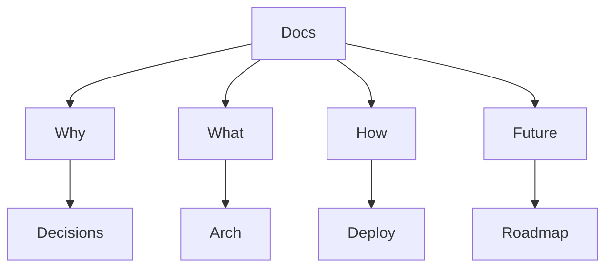

# Knowledge Graph System Obsidian Vault {#moc}

A block-based knowledge management system with graph visualization & LLM integration. [[02-What/project-summary|Built]] & [[04-Future/roadmap|Planned]].

## Navigation

> [!column] Sections
> 
> **[[01-Why/decisions|🧠 Why]]**  
> Decisions & research
> 
> **[[02-What/architecture|🏗️ What]]**  
> Architecture & features
> 
> **[[03-How/usage|🔧 How]]**  
> Usage & deployment
> 
> **[[04-Future/roadmap|🔮 Future]]**  
> Roadmap
> 
> **[[06-Challenges/decay|⚠️ Challenges]]**  
> Decay & verification

## Quick Access

| Category | Key Files |
|----------|-----------|
| Start | [[03-How/quick-start|Quick Start]] |
| Data Model | [[02-What/data-model|Data Model]] |
| Decisions | [[01-Why/decisions|Decisions]] |
| Decay | [[06-Challenges/knowledge-decay|Knowledge Decay]] |

> [!how] Typical Workflow
> 1. [[03-How/quick-start|Quick Start]]
> 2. Load sample data
> 3. Visualize graph `file '../../src/lib/sampleData.ts'`
> 4. Assemble doc via compositor
> 5. Export MD/PDF

