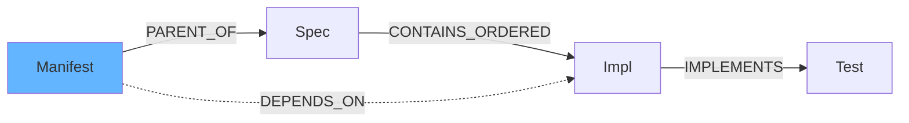

# System Architecture {#arch}

> [!abstract] Overview  
> Block-based with dual rels (structural/semantic), tag inheritance, 3-tier immutability. localStorage MVP → Neo4j.

## Data Model {#data-model}

### Block {#block}
```typescript
interface Block {
  id: string
  type: 'note' | 'requirement' | 'spec' | 'impl' | 'test' | 'manifest'
  templateId: string
  title: string
  content: string // MD/MDX
  tags: string[]
  immutability: 'mutable' | 'locked' | 'immutable'
  createdAt: Date
  updatedAt: Date
  version: number
  // Decay (missing): ttl, decayCategory, lastVerified
}
```

### Edge {#edge}
```typescript
interface Edge {
  from: string
  to: string
  type: 'PARENT_OF' | 'CONTAINS_ORDERED' | 'IMPLEMENTS' | 'DEPENDS_ON' | 'VERIFIED_BY'
  order?: number // Structural
}
```

### Tag {#tag}
```typescript
interface Tag {
  label: string
  group: 'org' | 'domain' | 'status' | 'priority'
  inheritable: boolean
  color: string
}
```

> [!how] Relationships  
> - **Structural**: Assembly (PARENT_OF, CONTAINS_ORDERED)  
> - **Semantic**: Discovery (IMPLEMENTS, DEPENDS_ON)



## Tech Stack {#stack}
| Layer | Tech |
|-------|------|
| Frontend | Next.js 14, React 18, TS |
| State | Zustand + localStorage |
| Viz | React Flow + Framer Motion |
| Styling | Tailwind, Glassmorphism |
| LLM | Gemini API |
| Future | Neo4j, GraphQL, Agents

## Design System {#design}
- **Colors**: BG #101520, Primary #63B5FF, Accent #B5FF63
- **Perf**: 60FPS 1000+ nodes, edge culling
- **Interactions**: Physics repulsion, flip animation

> [!why]- Glassmorphism  
> Modern depth, blur effects for focus.

