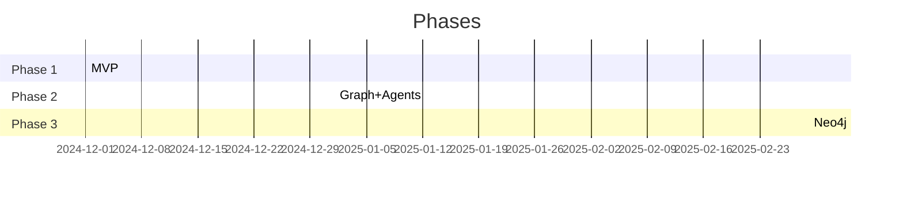

# Roadmap {#roadmap}

Phase 1 ✅ MVP: Blocks, graph, LLM chunking.

## Phases Table
| Phase | Q | Key Features | Timeline |
|-------|---|--------------|----------|
| 2 | Q1'25 | Graph algos, Tree-sitter, Ontology | 8-10w |
| 3 | Q2 | Neo4j, Auth, API | 10-12w |
| 4 | Q3 | Multi-LLM, GraphRAG, Agents | 12-14w |
| 5 | Q4 | Enterprise scale/security | 14-16w |
| 6 | '26 | Mobile/PWA | 16-20w |

> [!decisions] Key  
> See [[01-Why/decisions]]

> [!todo] Metrics: 10k nodes, 99.9% uptime.

